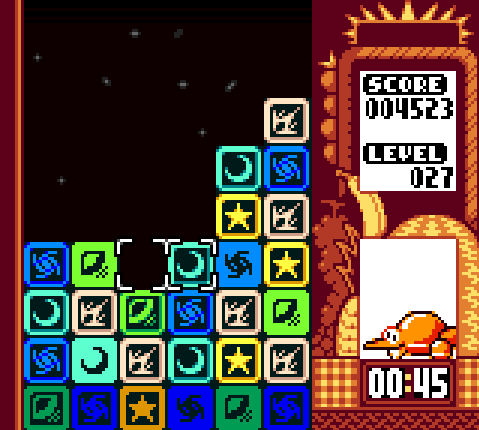

# Highlighters

  
  &nbsp;
  
  &nbsp;
  

## About
Highlighters is the next entry in the action-puzzle genre, inspired by the charming and stylish titles of the 90s like Tetris Attack and Puzzle Fighter. This game is easy on beginners, but also has a lot to offer for the skilled players of competitive, completionist and speedrunning tastes!

## Rules
Clear tiles by matching 4 or more like-colored pieces together, with at least one of them being a bomb (cross-shaped).

## Default Controls
**X:** Swap pieces, advance in menus, confirm

**Z:** Rise stack, speed up match animations, return in menus, cancel

**Arrow Keys:** Cursor movement

**ESC:** Quit game in menus, pause game in session
